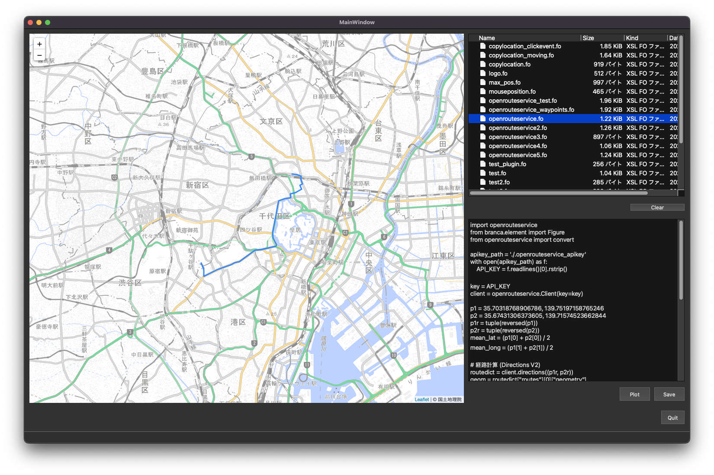

# これは何？

foliumを使って、地図を表示するツールです。
UIは、以下のとおりです。



第一引数にて指定したフォルダが右上に表示されます。
引数を省略すると、カレントディレクトリを表示します。

fo拡張子はfolium objectの略で、mapファイルの定義を記述しPlotを押下することにより、左側の画面に地図オブジェクトを表示します。

必要なライブラリをロードすることにより、さまざまな地図に対応できます。
Open Route Serviceの検索結果も表示可能です。

コードの例を以下に示します。


```pytnon
import openrouteservice
from branca.element import Figure
from openrouteservice import convert

apikey_path = './.openrouteservice_apikey'
with open(apikey_path) as f:
    API_KEY = f.readlines()[0].rstrip()

key = API_KEY
client = openrouteservice.Client(key=key)

p1 = 35.70318768906786, 139.75197158765246
p2 = 35.67431306373605, 139.71574523662844
p1r = tuple(reversed(p1))
p2r = tuple(reversed(p2))
mean_lat = (p1[0] + p2[0]) / 2
mean_long = (p1[1] + p2[1]) / 2

# 経路計算 (Directions V2)
routedict = client.directions((p1r, p2r),profile='foot-walking')
geom = routedict["routes"][0]["geometry"]
decoded = convert.decode_polyline(geom)


# 上の計算の続きで

def reverse_lat_long(list_of_lat_long):
    """緯度経度をひっくり返す"""
    return [(p[1], p[0]) for p in list_of_lat_long]

coord = reverse_lat_long(decoded["coordinates"])

# foliumでサイズ(600, 400)の地図を描画
fig = Figure(width=600, height=400)
m = folium.Map(location=(mean_lat, mean_long), tiles='https://cyberjapandata.gsi.go.jp/xyz/pale/{z}/{x}/{y}.png', attr='&copy; <ahref="https://maps.gsi.go.jp/development/ichiran.html">国土地理院</a>', zoom_start=13)
# 位置情報をPolyLineで地図に追加
folium.vector_layers.PolyLine(locations=coord).add_to(m)
```

上記のコードで、冒頭にお示しした地図が描画されます。
Open Route Serviceを使用するには、APIキーを取得する必要があります。

ハードコーディングはおすすめではないので、`.openrouteservice_apikey`にキーを入れて、以下のコードで読み出しています。


```python
apikey_path = './.openrouteservice_apikey'
with open(apikey_path) as f:
    API_KEY = f.readlines()[0].rstrip()

key = API_KEY
client = openrouteservice.Client(key=key)
```
# VS Codeの設定

VS Code で地図モデルの編集をするときにPythonとして認識してほしいので、VS Codeに以下の設定を行っています。

```
    "files.associations": {
        "*.fo": "python"
    },
```